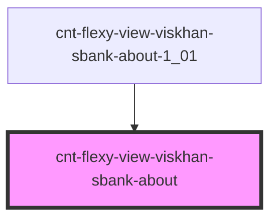

# cnt-flexy-view-viskhan-sbank-about

<!-- Auto Generated Below -->

## Properties

| Property        | Attribute | Description                     | Type                    | Default     |
| --------------- | --------- | ------------------------------- | ----------------------- | ----------- |
| `payload`       | `payload` | Данные компонента Collaboration | `any`                   | `undefined` |
| `sectionFourth` | --        | Интерфейс для SectionFourth     | `SSectionFourthItems[]` | `[]`        |

## Events

| Event                      | Description                 | Type               |
| -------------------------- | --------------------------- | ------------------ |
| `clickSectionFourthButton` | Клик по SectionFourthButton | `CustomEvent<any>` |
| `clickSectionFourthImage`  | Клик по SectionFourthImage  | `CustomEvent<any>` |
| `clickSectionFourthText`   | Клик по SectionFourthText   | `CustomEvent<any>` |
| `clickSectionFourthTitle`  | Клик по SectionFourthTitle  | `CustomEvent<any>` |

## Dependencies

### Used by

 - [cnt-flexy-view-viskhan-sbank-about-1_01](../../..)

### Graph

----------------------------------------------

*Built with [StencilJS](https://stenciljs.com/)*
