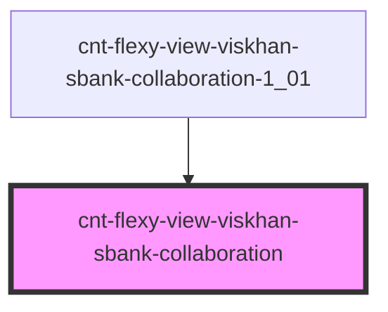

# cnt-flexy-view-viskhan-sbank-collaboration

<!-- Auto Generated Below -->

## Properties

| Property       | Attribute | Description                     | Type                    | Default     |
| -------------- | --------- | ------------------------------- | ----------------------- | ----------- |
| `payload`      | `payload` | Данные компонента collaboration | `any`                   | `undefined` |
| `sectionThird` | --        | Интерфейс для Collaboration     | `SCollaborationItems[]` | `[]`        |

## Events

| Event                        | Description      | Type               |
| ---------------------------- | ---------------- | ------------------ |
| `clickCollaborationImage`    | Клик по Image    | `CustomEvent<any>` |
| `clickCollaborationSubtext`  | Клик по Subtext  | `CustomEvent<any>` |
| `clickCollaborationSubtitle` | Клик по Subtitle | `CustomEvent<any>` |

## Dependencies

### Used by

 - [cnt-flexy-view-viskhan-sbank-collaboration-1_01](../../..)

### Graph

----------------------------------------------

*Built with [StencilJS](https://stenciljs.com/)*
