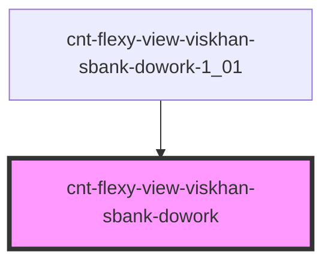

# cnt-flexy-view-viskhan-sbank-dowork

<!-- Auto Generated Below -->

## Properties

| Property        | Attribute        | Description          | Type                    | Default     |
| --------------- | ---------------- | -------------------- | ----------------------- | ----------- |
| `pathToAssets`  | `path-to-assets` |                      | `string`                | `undefined` |
| `payload`       | `payload`        | Массив для Dowork    | `any`                   | `undefined` |
| `sectionSecond` | --               | Интерфейс для Dowork | `SSectionSecondItems[]` | `[]`        |

## Events

| Event                 | Description      | Type               |
| --------------------- | ---------------- | ------------------ |
| `clickDoworkMyBlock`  | Клик по MyBlock  | `CustomEvent<any>` |
| `clickDoworkSubtitle` | Клик по Subtitle | `CustomEvent<any>` |
| `clickDoworkTitle`    | Клик по Title    | `CustomEvent<any>` |

## Dependencies

### Used by

 - [cnt-flexy-view-viskhan-sbank-dowork-1_01](../../..)

### Graph

----------------------------------------------

*Built with [StencilJS](https://stenciljs.com/)*
