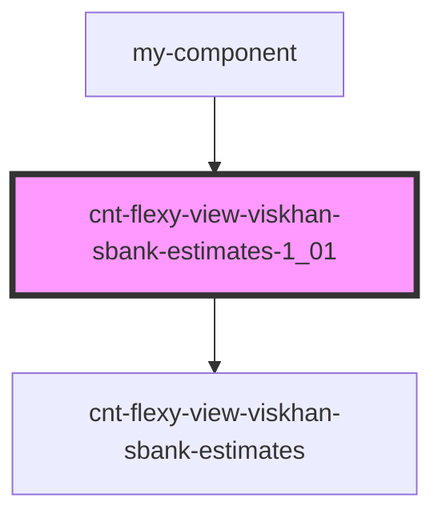

# cnt-flexy-view-viskhan-sbank-estimates-1_01

<!-- Auto Generated Below -->

## Properties

| Property       | Attribute        | Description                 | Type     | Default     |
| -------------- | ---------------- | --------------------------- | -------- | ----------- |
| `pathToAssets` | `path-to-assets` |                             | `string` | `undefined` |
| `payload`      | `payload`        | Данные компонента estimates | `any`    | `undefined` |

## Dependencies

### Used by

 - [my-component](../my-component)

### Depends on

- [cnt-flexy-view-viskhan-sbank-estimates](./res/view/cnt-flexy-view-viskhan-sbank-estimates)

### Graph

----------------------------------------------

*Built with [StencilJS](https://stenciljs.com/)*
