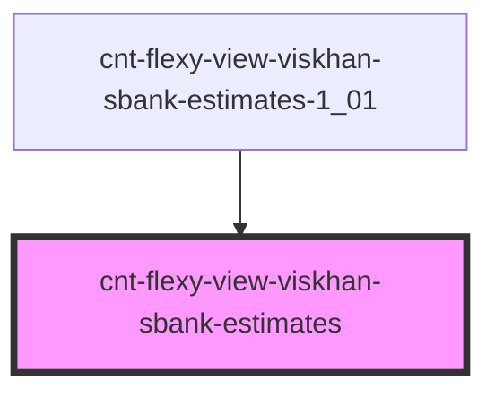

# cnt-flexy-view-viskhan-sbank-estimates

<!-- Auto Generated Below -->

## Properties

| Property       | Attribute | Description             | Type                   | Default     |
| -------------- | --------- | ----------------------- | ---------------------- | ----------- |
| `payload`      | `payload` | Массив для Estimates    | `any`                  | `undefined` |
| `sectionFirst` | --        | Интерфейс для Estimates | `SSectionFirstItems[]` | `[]`        |

## Events

| Event                   | Description     | Type               |
| ----------------------- | --------------- | ------------------ |
| `clickEstimatesButton`  | Клик по Button  | `CustomEvent<any>` |
| `clickEstimatesImage`   | Клик по Image   | `CustomEvent<any>` |
| `clickEstimatesSubtext` | Клик по Subtext | `CustomEvent<any>` |
| `clickEstimatesText`    | Клик по Text    | `CustomEvent<any>` |

## Dependencies

### Used by

 - [cnt-flexy-view-viskhan-sbank-estimates-1_01](../../..)

### Graph

----------------------------------------------

*Built with [StencilJS](https://stenciljs.com/)*
