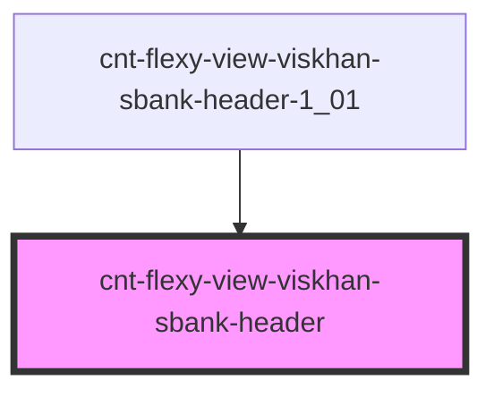

# cnt-flexy-view-viskhan-sbank-header

<!-- Auto Generated Below -->

## Properties

| Property     | Attribute    | Description          | Type             | Default     |
| ------------ | ------------ | -------------------- | ---------------- | ----------- |
| `categories` | `categories` | Массив для Header    | `any`            | `undefined` |
| `header`     | --           | Интерфейс для Header | `SHeaderItems[]` | `[]`        |

## Events

| Event                   | Description      | Type               |
| ----------------------- | ---------------- | ------------------ |
| `clickHeaderAboutUs`    | Клик по About    | `CustomEvent<any>` |
| `clickHeaderFeatures`   | Клик по Features | `CustomEvent<any>` |
| `clickHeaderHome`       | Клик по Home     | `CustomEvent<any>` |
| `clickHeaderHowItWorks` | Клик по How      | `CustomEvent<any>` |
| `clickHeaderLogo`       | Клик по лого     | `CustomEvent<any>` |
| `clickHeaderSignIn`     | Клик по SignIn   | `CustomEvent<any>` |

## Dependencies

### Used by

 - [cnt-flexy-view-viskhan-sbank-header-1_01](../../..)

### Graph

----------------------------------------------

*Built with [StencilJS](https://stenciljs.com/)*
