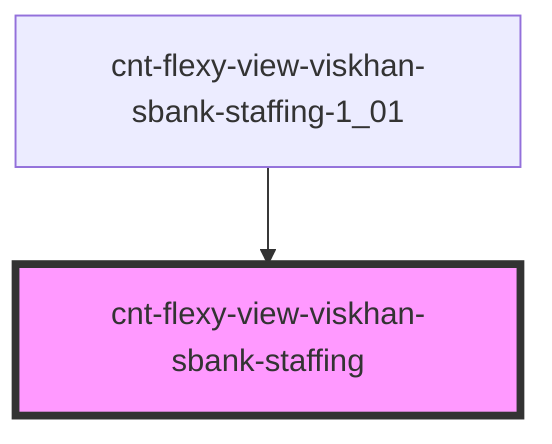

# cnt-flexy-view-viskhan-sbank-staffing

<!-- Auto Generated Below -->

## Properties

| Property   | Attribute | Description                | Type               | Default     |
| ---------- | --------- | -------------------------- | ------------------ | ----------- |
| `Staffing` | --        | Интерфейс для Staffing     | `SStaffingItems[]` | `[]`        |
| `payload`  | `payload` | Данные компонента Staffing | `any`              | `undefined` |

## Events

| Event                   | Description      | Type               |
| ----------------------- | ---------------- | ------------------ |
| `clickStaffingImage`    | Клик по Image    | `CustomEvent<any>` |
| `clickStaffingSubtext`  | Клик по Subtext  | `CustomEvent<any>` |
| `clickStaffingSubtitle` | Клик по Subtitle | `CustomEvent<any>` |

## Dependencies

### Used by

 - [cnt-flexy-view-viskhan-sbank-staffing-1_01](../../..)

### Graph

----------------------------------------------

*Built with [StencilJS](https://stenciljs.com/)*
