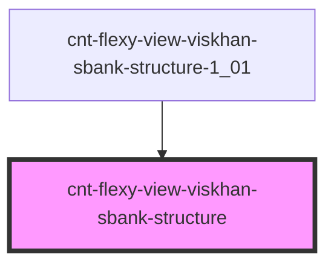

# cnt-flexy-view-viskhan-sbank-structure

<!-- Auto Generated Below -->

## Properties

| Property       | Attribute | Description             | Type                   | Default     |
| -------------- | --------- | ----------------------- | ---------------------- | ----------- |
| `payload`      | `payload` | Массив для Structure    | `any`                  | `undefined` |
| `sectionThird` | --        | Интерфейс для Structure | `SSectionThirdItems[]` | `[]`        |

## Events

| Event                    | Description      | Type               |
| ------------------------ | ---------------- | ------------------ |
| `clickStructureImage`    | Клик по Image    | `CustomEvent<any>` |
| `clickStructureSubtext`  | Клик по Subtext  | `CustomEvent<any>` |
| `clickStructureSubtitle` | Клик по Subtitle | `CustomEvent<any>` |
| `clickStructureText`     | Клик по Text     | `CustomEvent<any>` |
| `clickStructureTitle`    | Клик по Title    | `CustomEvent<any>` |

## Dependencies

### Used by

 - [cnt-flexy-view-viskhan-sbank-structure-1_01](../../..)

### Graph

----------------------------------------------

*Built with [StencilJS](https://stenciljs.com/)*
