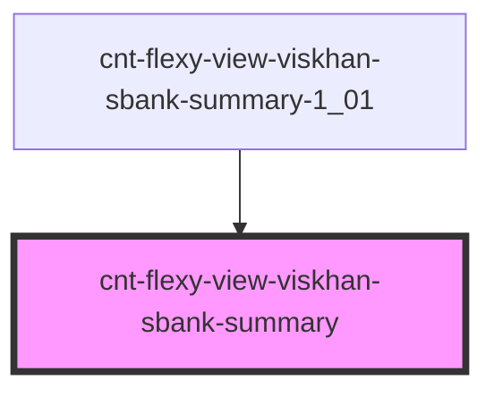

# cnt-flexy-view-viskhan-sbank-summary

<!-- Auto Generated Below -->

## Properties

| Property  | Attribute | Description               | Type              | Default     |
| --------- | --------- | ------------------------- | ----------------- | ----------- |
| `Summary` | --        | Интерфейс для Summary     | `SSummaryItems[]` | `[]`        |
| `payload` | `payload` | Данные компонента Summary | `any`             | `undefined` |

## Events

| Event                  | Description      | Type               |
| ---------------------- | ---------------- | ------------------ |
| `clickSummaryImage`    | Клик по Image    | `CustomEvent<any>` |
| `clickSummarySubtext`  | Клик по Subtext  | `CustomEvent<any>` |
| `clickSummarySubtitle` | Клик по Subtitle | `CustomEvent<any>` |

## Dependencies

### Used by

 - [cnt-flexy-view-viskhan-sbank-summary-1_01](../../..)

### Graph

----------------------------------------------

*Built with [StencilJS](https://stenciljs.com/)*
